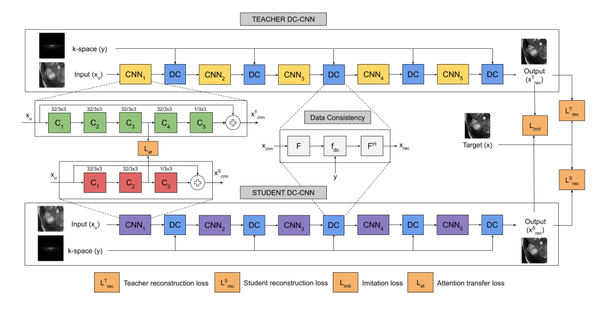
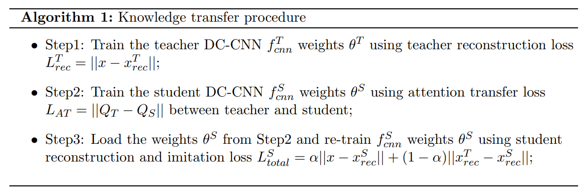
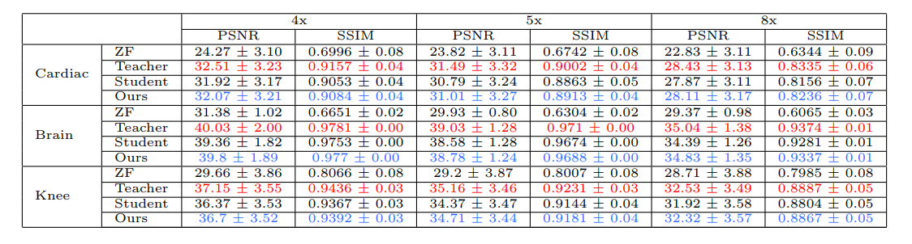
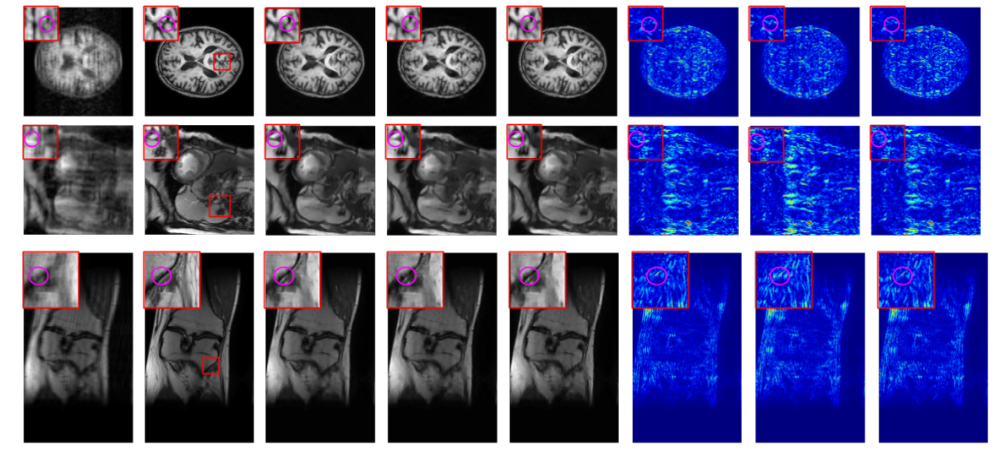
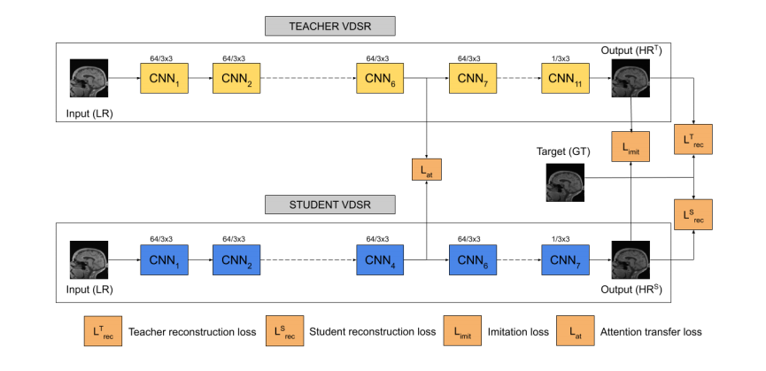
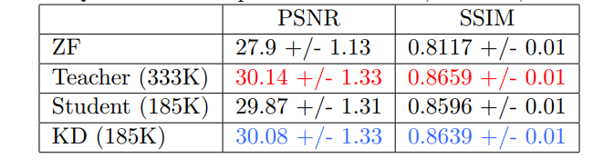
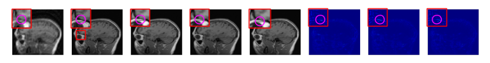

# KD-MRI
[A knowledge distillation framework for image reconstruction and image restoration in MRI workflow](https://openreview.net/forum?id=OrBdiT86_O)
## MRI Reconstruction
>Teacher DC-CNN: Five cascades with each cascade having five convolution layers. Student DC-CNN: Five cascades with each cascade having three convolution layers. Attention transfer and imitation loss helps in teacher-student knowledge transfer. Attention transfer loss is obtained between the output of third and second convolution layer of each cascade in Teacher and Student DC-CNN. Imitation loss is obtained between the outputs of Teacher and Student DC-CNN.

>Train Procedure

>Quantitative comparison between Zero-filled (ZF)(US Image), Teacher (T-DC-CNN), Student (S-DC-CNN) and our proposed model (S-KD-DC-CNN) across PSNR and SSIM metrics for ACDC, MRBrainS and Knee MRI datasets. Red indicates best and blue indicates second best performance.

>From Left to Right: Zero-filled, Target, Teacher (T-DC-CNN), Student (S-DC-CNN), Ours (S-KD-DC-CNN)), Teacher Residue, Student Residue, KD Residue. From Top to Bottom: MRBrainS, ACDC, Knee MRI. All the images are displayed for an acceleration factor of 5x. Upon examination, in addition to lower reconstruction errors the distilled model is able to retain finer structures better when compared to the student.

## MRI Super-resolution
>Teacher VDSR: 11 convolution layers. Student VDSR: 7 convolution layers. Attention Transfer Loss: Loss between sixth convolution layer of teacher and fourth convolution layer of student VDSR. Imitation Loss: Loss between reconstructed output of teacher and student VDSR.

>Quantitaive comparison of Teacher, Student, KD VDSR

>From Left to Right: Undersampled, Target, Teacher, Student, Ours(KD), Teacher Residue, Student Residue, KD Residue. As with MRI Reconstruction, in addition to lower reconstruction errors the distilled model is able to retain finer structures better when compared to the student.
